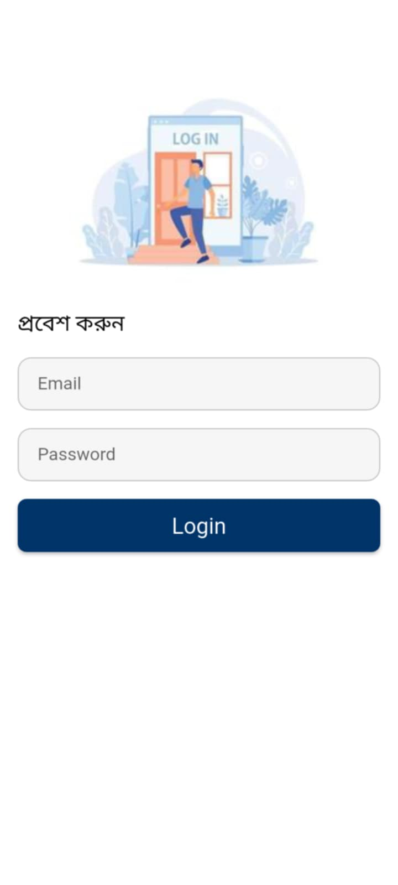
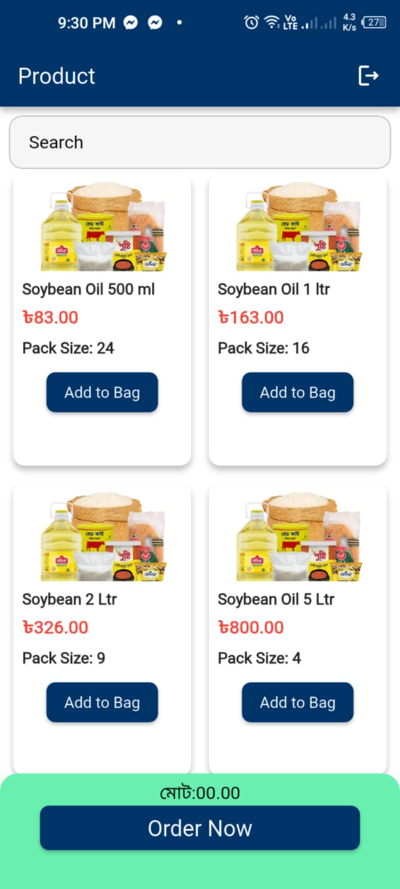
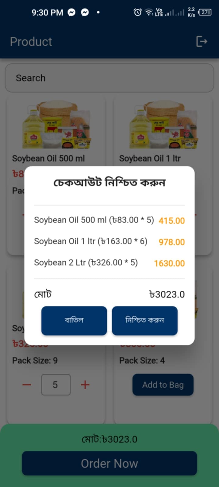

# E-commerce with Bloc

## Description
Welcome to the E-commerce App, Your ultimate E-commerce App for seamless shopping and product updates at your fingertips!

## Key Features
- **State Management Bloc:** Utilizing the power of Bloc architecture ensures a robust and scalable application structure, enhancing code organization and maintainability.

- **Clean Code with Detailed Comments:** Our codebase boasts clean and well-organized code, complemented by detailed comments for enhanced readability and maintainability, streamlining the development process.

- **Product Listing:** Showing the product with price. Searching ability with the product name. Add to card you product.

- **User-Friendly Interface:**  Enjoy a sleek and intuitive user interface designed for seamless navigation and enhanced user experience.

## Screenshots

|                                 Login Screen (c)               |         Product Screen (F)                                  |                   Checkout Screen                                  |                                |
|:--------------------------------------------------------------:|:--------------------------------------------------------------:|:--------------------------------------------------------------:|:--------------------------------------------------------------:|
|  |  |  |

## Download APK
1. Download Link : `https://drive.google.com/drive/folders/1WArw4z3WX8jkcu1vC0QJZy64OK8CwwNR?usp=drive_link`

## Installation
1. Clone the repository: `https://github.com/sm-mozammal/E-Commerce_Bloc.git`
2. Install dependencies: `flutter pub get`
3. Run the app: `flutter run`
4. Flutter version: `3.27.2`

## Contributing
`S.M. MOZAMMAL HOSSAIN IMON`
